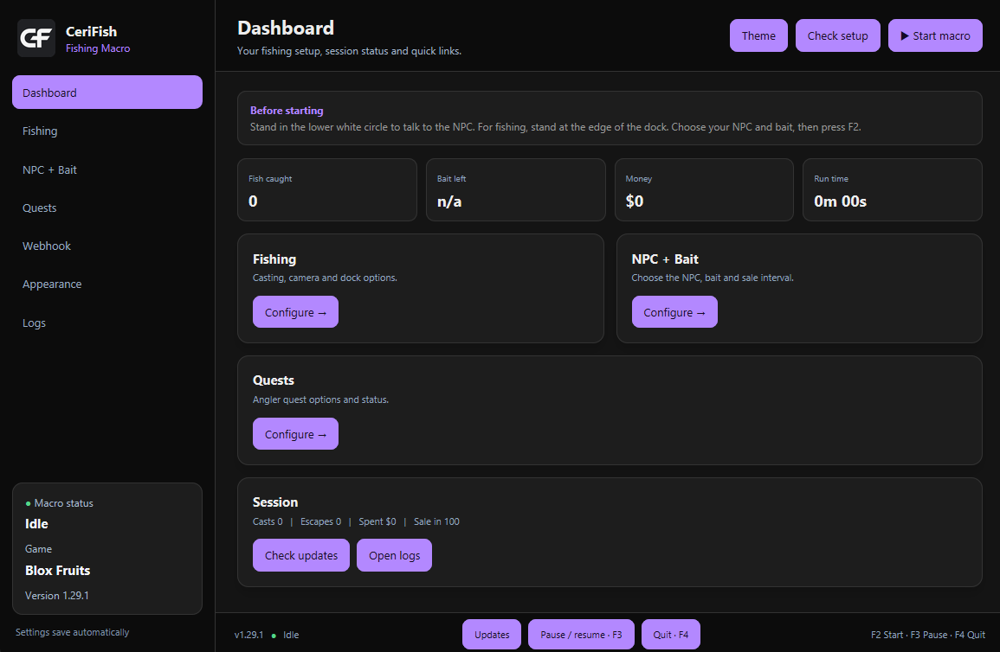

# CeriFish — Fishing Macro

AutoHotkey v2 macro for automating fishing in **Blox Fruits**.

The macro uses screen capture, color detection and Windows OCR to read the fishing bar, the bite indicator, the fish position, chests, the cast charge meter, NPC/shop menus and the quest panel. It controls the reel automatically and can buy bait, sell fish, do the Angler quests and report to Discord.

Current version: **1.29.6** (see `CHANGELOG.md` for the full history).

## Preview

Dashboard preview using the Sunset theme:



## Features

- Automatic casting (optional **Perfect cast**), bite detection and reel controller
- Treasure chest collection during the minigame (a chest must be seen on several reads in a row, so false chests are ignored)
- Auto-buy bait and auto-sell fish at the NPC (live bait counter, income and level tracking)
- **Auto-quest at the Angler** (all four quest types, survives a restart)
- Death detection (the Health text reads 0/x), re-anchoring after a missed bite, safety stops with a game screenshot
- Discord webhook: live messages, hourly report with an image card, quest messages, error alerts
- HTML/CSS control panel in `BloxFishing.html`, loaded inside the AHK window with AutoHotkey's ActiveX control; grouped settings, live status and themes
- **Obsidian** is the default theme; your saved theme choice is kept.
- CeriFish CF monogram appears in the app header and Windows taskbar/window icon.
- GitHub version check at startup and an Updates button; asks before installing and keeps a `.bak` backup
- Pause / resume without losing the session

## Updates

The macro checks the repository's `main` branch once after startup. If a newer version is available, it asks before downloading and restarting. Select **Updates** in the footer to check manually. The updater downloads `BloxFishing.ahk`, `BloxFishing.html`, and the logo/icon assets together, backs up the interface and assets, and leaves your settings in `BloxFishing.ini`.

## Requirements

- Windows
- [AutoHotkey v2.0+](https://www.autohotkey.com/)
- Keep `BloxFishing.ahk` and `BloxFishing.html` in the same folder; AHK loads the HTML panel inside its own window.
- Roblox and Blox Fruits
- The macro must be run with administrator privileges (it asks for them itself)
- Roblox in **windowed or borderless fullscreen**
- Supported resolution profiles: `1920x1080`, `2560x1440`, `1366x768` (RDP / small screens) and `Auto`

> The selected profile must match the Roblox game area closely, otherwise screen detection can fail. The `1366x768` profile is scaled from 1920x1080 and has not been fully measured.

---

## Installation

1. Install **AutoHotkey v2**.
2. Put `BloxFishing.ahk` anywhere on your PC.
3. Double-click `BloxFishing.ahk` and accept the administrator (UAC) prompt.
4. Start Roblox and open **Blox Fruits**.
5. Go to your fishing NPC (Fisherman or Angler) and stand exactly as described in **Critical: stand at the NPC** below, with the **Interact** prompt visible.
6. Equip your fishing rod.
7. Make sure **Shift Lock is OFF**.
8. Configure the macro window, then press **F2**.

The macro enables and verifies Shift Lock by itself when it starts fishing.

## ⚠️ stand at the NPC, right on the edge of the interaction range

**Required.** Your character must be at the outer edge of the Fisherman's interaction circle and lined up at 0°: directly in front of or directly behind the NPC, on one straight line through its centre. Do not start from a diagonal angle. This lets the game's push return you to the same edge instead of drifting sideways.

**Do this**

- Face the Fisherman and wait until the Interact prompt is visible.
- Move to the outer boundary while staying on the NPC's straight centre line. Imagine a line from the NPC's middle through your character. That is the 0° lane.
- Use only tiny adjustments. You should be close enough to interact but not deep inside the circle. Keep the camera still, then start the macro.

**Avoid**

Too close can reopen the dialogue while casting; too far makes the anchor fail. Starting even slightly diagonal means the game's outward push can land you on another edge. Repeating the same backward movement from that wrong edge compounds the angle until the macro can miss the NPC.


**Reference image**


---

## Before pressing F2

- Roblox is open and you are in Blox Fruits.
- Your rod is equipped and the **Rod hotbar slot** in the macro is correct.
- You are close enough to the NPC for the Interact prompt to appear.
- Shift Lock is OFF.
- The resolution profile matches your game window.
- Use **Check setup** on the Dashboard to verify administrator status, resolution, game area and reel bar detection.

---

## Controls

| Key | Action |
|---|---|
| `F2` | Start / Stop the macro |
| `F3` | Pause / Resume |
| `F4` | Quit the macro |
| `F8` | Enable / disable the debug log file |

The same actions are available as buttons on the Dashboard. When stopped, the macro releases the mouse button automatically.

---

# Pages of the macro window

## Dashboard

The dashboard shows fish, bait, money, level and session time. Use its cards to open Fishing, NPC + Bait, Quests or Webhook. The left navigation keeps Logs and Appearance one click away. The footer keeps Start / Stop, Check setup, Updates, Pause, Quit and shortcut keys easy to find. The activity stream is on the Logs page.

## Fishing

**Casting**
- **Perfect cast**: reads the whole charge bar (orange > yellow > green) and releases at the chosen percentage (**Release at**, default 97 %). With zoom-out 8 the bar is small, so 96-98 % works well. With Perfect cast off, a quick fixed-timing cast is used.
- **Lock camera zoom**, **Zoom-out notches**, **Re-apply the zoom every N casts**, **Tilt down (px)**: camera setup used for stable detection.

**Reeling and recovery**
- **Collect treasure chests**
- **Faster bite reaction**: reacts to the bite faster. Turn it off if bite detection is unreliable.
- **Slower fish trick**: slower timing for the quick unequip / re-equip of the rod. Leave it off if the normal timing works.
- **Anchor at the NPC on start** (recommended): opens and closes the NPC dialogue, returns to the fishing position, enables Shift Lock and checks that the cursor is centered, so the macro starts from a known position.

**Game**
- **Screen resolution**: `Auto`, `1920x1080`, `2560x1440` or `1366x768`.
- **Rod hotbar slot**: `1`-`9`, `0`.
- **Turn on Fast Mode + Reduce Motion when the macro starts**.

## Quest

Auto-quest only works when **AFK at** is set to **Angler** (Shop and Bait page).

- **Auto-quest** switch and **Rod skill key** (`Z`, `X`, `C`, `V` or `F`, default `Z`).
- Live quest status and the list of quests the macro handles:
  1. Catch a Common / Uncommon / Rare / Epic / Legendary / Mythical fish
  2. Catch 3 fish within 2:05 (fast bite is forced on; sales and bait trips wait)
  3. 3 perfect casts + 3 perfect reactions (Perfect cast and fast bite are forced on; done only when both counters read n/n)
  4. Use a rod skill 3 times (uses the Rod skill key)
- Discord toggles: **Quest accepted**, **Quest finished**, **Quest failed**.

How it works:
- The Angler offers one quest every 15 minutes, counted from the moment a quest is accepted. An unfinished quest must be finished or abandoned before a new one is offered.
- The macro reads the quest panel (top-left HUD) with Windows OCR and checks the progress bar with a cheap pixel scan.
- When the quest is finished it talks to the Angler once to hand it in. If the Angler answers "Still waitin' on you to get that task done", the macro treats the quest as not finished and goes back to fishing.
- If the Angler says he has no tasks yet, the macro waits for the cooldown and asks again.
- The quest state is saved in `BloxFishing.ini`, so a restart continues the quest instead of asking for a new one.
- Three failed visits in a row switch auto-quest off until the next start.
- Unknown quest texts are written to the log as `[quest] UNKNOWN quest text ...`. The Fisherman has quests the macro does not know yet.

## Shop and Bait

- **AFK at**: `Fisherman` or `Angler`. With the Angler, auto-sell is off and auto-quest is available.
- **Auto-buy bait when it runs low**, **Bait type**, **Bait in inventory now** (`0` = do not count, max 100, updates live), **Bait per purchase** (10-100, multiples of 10). The inventory holds 100 bait at most, so the macro only buys what fits.
- Baits: Basic, Kelp, Good (Sea 1); Abyssal (Sea 2, needs Demonic Wisp); Frozen (Sea 2, needs Yeti Fur); Epic (Sea 3, needs Terror Eyes); Carnivore (Sea 3, needs Dragon Scale). Locked baits cannot be bought.
- **Auto-sell fish every N catches**
- **Track income** and **Track levels**: read your `$` and level with Windows OCR.

## Webhook

- **Enable webhook**, **Webhook URL**, optional separate **hourly report URL**, display name and mention.
- Messages you can toggle: macro started, stopped + session summary, fish sold, bait purchased, screenshots, errors + game screenshot, buying / selling, casting and hooked, fish caught + progress, catch screenshot, chest collected, and the three quest messages.
- While the macro and webhook are active, hourly reports are sent automatically at every full hour on the PC's local clock (for example 11:00, 12:00, 13:00). The schedule is fixed and cannot be disabled or rescheduled; **Send report now** remains available for a manual report.
- **Send report now** sends the hourly report image card immediately.
- The stop and error messages are plain text embeds sent to the normal webhook. The hourly image card goes only to the hourly report URL (or the normal one if that field is empty).
- On an error stop, one message includes the reason, the session summary, the last 8 log lines and a game screenshot.

---

# How the fishing loop works

```text
Start
  ↓
Check Roblox, establish NPC anchor
  ↓
Enable + verify Shift Lock
  ↓
Check quest / bait / sell requirements
  ↓
Cast → wait for bite → click the bite
  ↓
Detect fishing bar → track fish + green zone → control the reel
  ↓
Detect the end of the minigame, dismiss the catch notification
  ↓
Repeat
```

If something goes wrong, the macro has several recovery checks and stops itself when it cannot safely confirm the game state.

**Death check:** the macro stops when the Health text reads `0/x` (two OCR reads in a row), or when the `Died Recently - PvP disabled` HUD first appears after fishing begins. The HUD baseline is sampled after NPC setup, since the badge can persist after respawn and the NPC dialogue has similar white text. When present, its overlap with the fishing progress strip is accounted for.

## Automatic detection

The macro uses screen capture and color detection for: fishing bar, green reel zone, fish position, treasure chests, bite indicator, cast charge meter, NPC dialogue panels, craft button, recipe `Learn` button, fishing progress and the quest panel. It also uses Windows OCR for the quest text, money, level and bait count.

Regions and click points are fractions of the Roblox game window, so the same calibration works across the supported resolution profiles.

---

# Files

```text
BloxFishing/
├── BloxFishing.ahk
├── BloxFishing.ini       ← generated automatically (settings + saved quest state)
├── BloxFishing.log       ← generated when debug logging is enabled (F8)
├── errors/               ← game screenshots saved on every problem (newest 40 kept)
├── images/
│   └── anchor-reference.png   ← reference image used by the README
├── CHANGELOG.md
├── README.md
├── LICENSE
└── .gitignore
```

## BloxFishing.ini

Created next to the script. It stores all your settings (display, fishing, camera, quest, shop, webhook) and the current quest, so a restart does not lose them. Delete it only if you want the defaults back.

```ini
[display]
resolution=Auto
theme=Midnight

[fishing]
rodSlot=4
perfect=1
perfectPct=97
chest=1
anchor=1

[quest]
questOn=1
questKey=Z

[shop]
npc=Fisherman
buyBait=1
baitPer=40
sellOn=1
sellEvery=100
```

The `[game]` section also accepts `rdp=auto|on|off` (remote desktop handling, `auto` by default).

## BloxFishing.log

Toggle with `F8`. Contains the tagged lines that also appear in the activity log: `[start]`, `[cast]`, `[bite]`, `[reel]`, `[chest]`, `[bait]`, `[sell]`, `[catch]`, `[quest]`, `[error]`, `[warn]`, `[stop]`. Send the relevant lines when reporting a problem.

---

# Troubleshooting

**The macro does not click Roblox**
Run it as administrator, start it after Roblox is open and keep Roblox focused. Roblox ignores injected input from a non-elevated process.

**Shift Lock could not be verified**
Roblox must be focused, Shift Lock Switch must be enabled in Roblox settings, Shift Lock must be OFF before F2, and you must be inside Blox Fruits. The macro refuses to fish when it cannot confirm the centered state.

**The fishing bar is not detected**
Check the resolution profile and that the Roblox window is not heavily resized or covered. Use **Check setup**.

**The bite is not detected**
Try turning **Faster bite reaction** on or off, and make sure no other UI covers the bite indicator.

**The rod slot is wrong**
Set **Rod hotbar slot** to the slot that holds your rod.

**The shop does not work**
Stand close enough to the NPC for the Interact prompt, check the rod slot and resolution, and make sure no NPC dialogue is already stuck open.

**The quest is reported finished too early, or the Angler says "Still waitin'"**
Fixed in 1.24.1 / 1.24.2. If it still happens, send the `[quest] progress:` and `[quest] the Angler says` log lines.

**The quest is not recognised**
Send the `[quest] UNKNOWN quest text` log line and a screenshot of the quest panel and the dialogue.

**The macro stopped with "character dead" but the character is alive**
Fixed in 1.24.4: death now needs the Health text to read `0/x`. If it still happens, send the `[death]` log lines and the screenshot from the `errors` folder.

**A chest was grabbed that was not there**
Fixed in 1.24.4: a chest must be seen on 4 reads in a row, and the macro goes back to the fish if it disappears. If it still happens, send the `[chest]` and `[reel]` log lines.

**After buying bait the menu stays open / no Nevermind**
Fixed in 1.24.3: the menu counts as closed only if it stays closed for about 0.9 s.

**Something stopped the macro**
Look in the `errors` folder for the game screenshot taken at the moment of the problem (it is also sent to Discord when **Errors + game screenshot** is on).

---

# Recommended first test

```text
Resolution:        Auto
Rod slot:          Your rod slot
Faster bite:       OFF
Slower fish trick: OFF
Collect chests:    ON
NPC anchor:        ON
Perfect cast:      ON
Auto-quest:        OFF
Buy bait:          OFF
Sell every:        OFF
Webhook:           OFF
```

1. Stand in the lower white circle at the fishing NPC with the Interact prompt visible.
2. Equip your rod and turn Shift Lock OFF.
3. Press **Check setup**.
4. If everything looks correct, press **F2**.
5. Watch the first few cycles before leaving it unattended, then enable bait, selling, quests and the webhook one at a time.

---

## Credits

This project was created with assistance from **Claude by Anthropic**.
